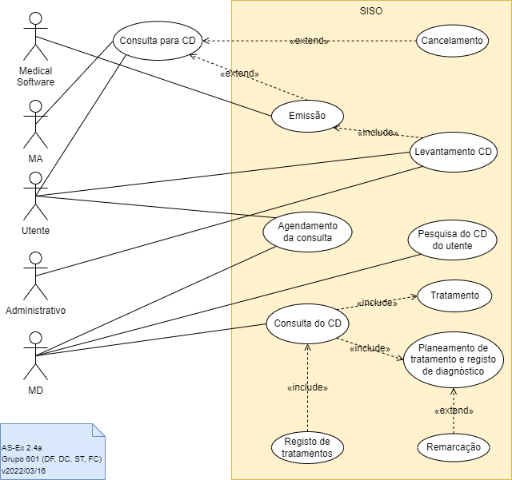

# Lab 1 - Process Modulation

## Group - **601**

|   Members                     | Mecanografic Number  |
|   :-                          |   :-:                |
| Daniel Capitão | 75943 |
| David Ferreira| 93444 |
| <u>Samuel Teixeira</u>  | 103325 |
| Filipe Costa | 77548 |

## Exercise 2.1

The diagram represents a **use case** modeling that describes the functioning of a system with the purpose of **purchasing items online**.

The system visually represents actors, use cases and their relationships/associations that occur throughout the narrative.

**Web customers** are divided into **registered customers** and **new customers**. New customers(visitors) can only view itens and register in the system. The registration of the new customer is done by the **authentication service**, thus becoming a registered customer, allowing the viewing and purchase of items. Items and payment solutions at checkout are secured by the identity provider and duly authenticated in the system. Checkout can be done via **paypal** or **credit payment service**.

## Exercise 2.2

## Exercise 2.3 - (Ainda em Revisão)

|Caso de utilização:|**Entregar um trabalho**|
| :- | :- |
|Versão:|v18/03/2022|
|Breve descrição |
O Aluno acede à página da disciplina, acede à atividade aberta e faz upload do trabalho dentro do formato e período que o Aluno configurar.

O Aluno cria um novo trabalho (=atividade) para os aluno na página da disciplina, escolhendo um dos tipos de trabalho disponíveis. O trabalho fica disponível para os alunos e aceita entregas no formato e período que o Aluno deve configurar.
|
|Pré-condições:|
O Aluno tem conta ativa.

A Unidade Curricular (UC) tem edição activa para o presente semestre.

O Aluno está associado à UC, com o papel de Aluno.
|
|Pós-condições|
Atividade disponível na vista do aluno para revisão(exeto se configurada uma data para fim de atividade).

Atividade incluída na coleção de trabalhos da discipina e nas várias vistas associadas (página da UC, manu de acesso rápido aos trabalhos, entradas da Pauta da UC) com visto de concretização assinalado.
|
|Fluxo base:|
**1. Aceder à página do aluno**

Inicia quanto o Aluno acede à sua página “my Elearning” para submeter um trabalho. O sistema verifica a sessão ativa do utilizador. Se necessário, o sistema redireciona para página de autenticação do IdP central. O IdP retorna o contexto da sessão com o perfil do utilizador.

**2.  Selecionar Unidade Curricular** 

O sistema lista as UC ativas daquele aluno na página de entrada, de forma destacada. O Aluno seleciona a UC pretendida. O sistema apresenta a página de entrada da disciplina com painéis com opções para administrar a página. Se a UC estiver configurada no modo semanal, o sistema deve posicionar na semana atual, por omissão.

**3. Submissão do trabalho**

O Aluno seleciona o trabalho que pretende entregar e escolhe a opção/símbolo de submeter atividade colocada nessa zona. Abre um sistema de exploração de ficheiros   para o aluno navegar até encontrar o trabalho a anexar.

**4.  Configurar os parâmetros de submissão**

O Aluno fornece um título e anexo(ficheiros de trabalho). 

O sistema propõe valores por omissão para o autor do trabalho disponível.

O Aluno pode ainda selecionar um tipo de licença que pretende.

**5.  Confirmar submissão.**

O Aluno confirma a submissão do trabalho.

O sistema destaca entrega de trabalho fora do tempo limite, atividade fechada, formato inválido, tamanho excessivo do trabalho ou qualquer outro tipo de problema associado ao parâmetros definidos pelo admin ou professor da UC, marcando o fundo com uma cor de aviso.

O sistema mostra a página principal da UC, posicionada no sítio onde foi criado o trabalho. 
|
|Fluxos alternativos:|
**Passo 1: Aluno não está nesta UC**

O sistema verifica que o aluno não pertence à UC e mostra uma mensagem de erro. A navegação retorna a página de entrada do utilizador. 

**FA3a: Remoção do Trabalho**

O Aluno pode após prévio envio do trabalho remover o mesmo ao escolher apção/símbolo disponiveis para o aluno na zona de entrega da atividade.

**FA3b: Re-Envio do Trabalho**

O Aluno pode após prévio envio do trabalho re-enviar nova versão do mesmo ao escolher apção/símbolo disponiveis para o aluno na zona de entrega da atividade.

**FA3c: Cometarios.**

O Aluno pode adicionar comentários após e durante o envio do trabalho.
|
|Exceções:|
**Ex1: Sistema de autenticação indisponível**

**Ex2: Passo 1: Aluno não está nesta UC**

|
|Requisitos especiais:|
[Usabilidade] O campos de texto livre devem suportar texto com hipermedia, inserido com o apoio de um *widget* com opções para formatar o texto e colocar hiperligações.

[Usabilidade] A escolha de ficheiros do sistema de ficheiros deve, em alternativa, suportar *drag-and-drop* para a página.

[Desempenho] A autenticação com o IdP tem de responder em menos de 2 segs.
|

## Exercise 2.4

### a)

### b)

The analyses of the Diagram 1 is in a form of comparison with the one created and displayed before, assuming the one created by the team is correct, we can point out some incorrectness in the one provided in the assignment. This being said, the corrected version of the Diagram 1, will be base on the Diagram of the previous point.

The **first error** is in assuming that the**MA (Assistant Doctor) actor has power over action inside** the SISO. This is not correct since the first appointment of the pacient, provided by this doctor operates outside this system.

Other problem is the *Utilizar* use caso, wich is not an non option for the **CD** since this to be provided to the **MD (Dental Doctor)** in a later phase.

The fact that the **Medial Softaware** actor, wich is essential for the emission of the CD, by communicating it directly to the **SISO system**, is not represented in the Diagram 1, is another incorrecteness.

The use case of **Assinar o CD em papel** is a specification of an action and not of an intention of the actor, **wich is incorrect**.

A **over specification** can also be pointed to the **included use case** *Selecionar o dente do odontograma*. This does adds no relevant information to the Diagram 1 since is specific to the operation and work of the medical specialist and not relevant to the **SISO system**.

The fact that an important **use case** like the **rescheduling of an new appointement** is not represented, as a **crucial piece of information relevant to the function of the overall system**, is considered to be a **major flaw**.

### c)

